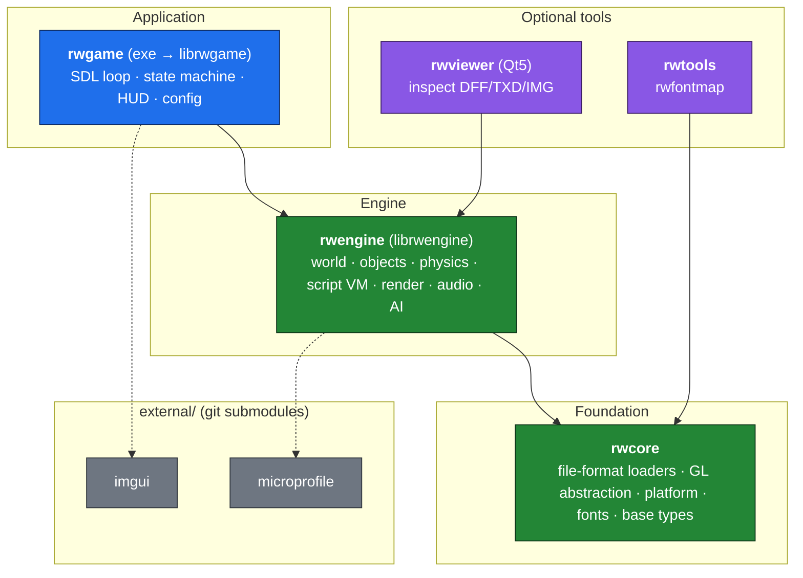
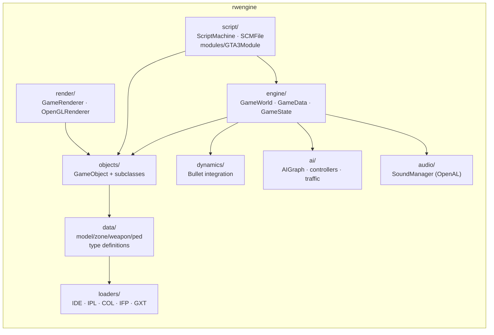
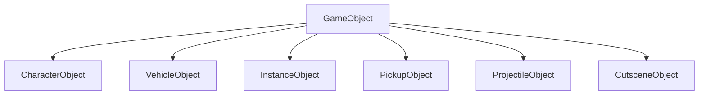
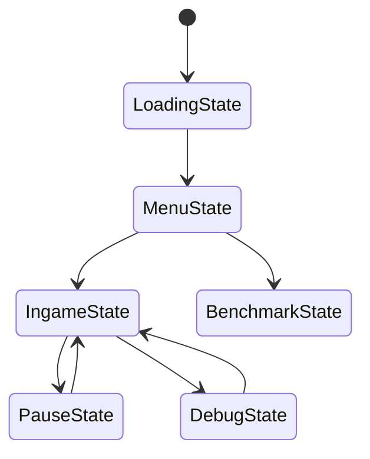
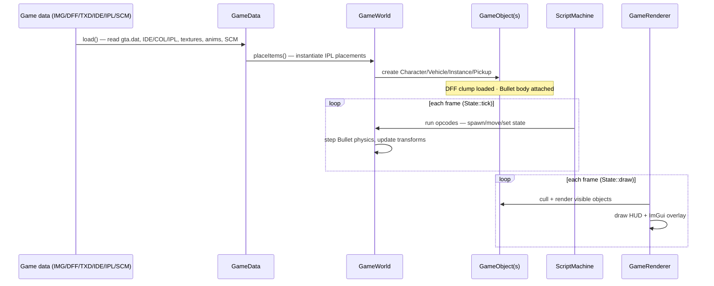

# OpenRW — Architecture Overview

OpenRW is a clean-room, open-source re-implementation of the **Grand Theft Auto III**
game engine in C++17. It ships *no* game content — a legitimate copy of the original
PC data is required to run the game — but the engine itself (loaders, world, physics,
renderer, script VM) is entirely original code.

This document is a short, high-level map of the codebase. For build/test/run commands
see [`CLAUDE.md`](CLAUDE.md) and [`README.md`](README.md).

---

## 1. Layered library structure

The code is organised into four CMake targets with a **strictly upward** dependency
direction. Lower layers never reach up into higher ones.

| Target | Kind | Depends on | Responsibility |
|--------|------|-----------|----------------|
| `rwcore` | library | Boost, GLM, OpenGL | File-format loaders, GL wrapper, platform, fonts, base types — **no game logic** |
| `rwengine` | library | `rwcore`, Bullet, FFmpeg, OpenAL | The actual game engine: world, objects, physics, scripting, rendering, audio, AI |
| `librwgame` / `rwgame` | static lib + exe | `rwengine`, SDL2, imgui | Player-facing executable: window/input loop, state-machine frontend, HUD |
| `rwviewer` | exe | `rwengine`, Qt5 | Qt GUI to inspect archives & models (`BUILD_VIEWER`) |
| `rwtools` | exe | `rwcore`, Freetype, Qt5 | Utilities, e.g. `rwfontmap` (`BUILD_TOOLS`) |

> Tests link against `librwgame`, so test code can reach the full stack.

---

## 2. Engine internals (`rwengine/src/`)

`rwengine` is the heart of the project. Three long-lived **hubs** anchor everything,
and the subsystems below map one-to-one onto the `rwengine/src/` directories.

### 2.1 Core hubs (`engine/`)

Three objects own the live game:

- **`GameWorld`** — central hub holding all live objects, the Bullet physics world,
  the AI graph, audio, and a pointer to the current state. Objects are allocated from
  six per-type `ObjectPool`s (pedestrian, instance, vehicle, pickup, cutscene,
  projectile). It spawns objects and traffic and steps the simulation each frame.
- **`GameData`** — owns *loaded asset data*: model definitions, textures, animations,
  collision, weather, zones, GXT text. `GameData::load()` drives the master load
  sequence (see § 2.9 and § 5).
- **`GameState`** — the serializable save-game state (time, player info, mission flags).

Logging and profiling helpers live in `core/` (`Logger`, `Profiler`).

### 2.2 Object model (`objects/` vs `data/`)

The engine keeps **type definitions** and **live instances** strictly apart:

- `data/` holds parsed type/definition data read from disk (`ModelData`, `WeaponData`,
  `ZoneData`, `PedData`). One definition, shared by many instances.
- `objects/` holds the **live runtime instances** placed in the world. `GameObject` is
  the base class:

An object is created through a `GameWorld` factory into the matching pool and destroyed
by removal from that pool. A weapon a character carries is an `items/Weapon` instance
backed by a shared `data/WeaponData`.

### 2.3 Physics & collision (`dynamics/`)

`GameWorld` owns the Bullet stack — collision configuration, dispatcher, `btDbvtBroadphase`,
sequential-impulse solver, and a `btDiscreteDynamicsWorld` with gravity `(0, 0, −9.81)`.
It registers an internal tick callback, `PhysicsTickCallback`, which on each fixed Bullet
substep walks the vehicle, pedestrian, and instance pools calling `tickPhysics()` on every
object. `dynamics/` holds the per-object glue: `CollisionInstance` builds a Bullet rigid
body from a COL model and attaches it to a `GameObject`; `HitTest` runs ghost-object
sphere/box overlap queries (used by melee and AI checks); and `RaycastCallbacks` provides
the closest-hit ray callback used by the raycast vehicle — the wheels/suspension model
implemented in `objects/VehicleObject`. Weapon hitscan raycasts (`dynamicsWorld->rayTest`)
are issued from `GameWorld::doWeaponScan`. Where this step sits in the frame is shown in § 5.

### 2.4 Script VM (`script/`)

`script/` is the SCM bytecode virtual machine that runs the original game's mission logic:
`ScriptMachine` executes `SCMFile` bytecode, and the GTA III opcode implementations live in
`script/modules/GTA3Module` (with the bulk in `GTA3ModuleImpl.inl`). Opcodes call directly
into `GameWorld` / `GameState` to spawn objects, set variables, and advance missions.

### 2.5 AI & character control (`ai/`)

Every `CharacterObject` is driven by a `CharacterController` subclass — `PlayerController`,
which translates player input, or `DefaultAIController`, which steers autonomous peds.
`AIGraph` / `AIGraphNode` hold the navigation path graph loaded from the map, and
`TrafficDirector` uses it to spawn vehicle and pedestrian traffic near the camera.

### 2.6 Rendering (`render/`)

`GameRenderer` orchestrates the frame, drawing through `OpenGLRenderer` (the GL state
abstraction over `rwcore/gl`). It frustum-culls with `ViewFrustum` / `ViewCamera`, draws
world objects via `ObjectRenderer`, then runs specialized passes — `WaterRenderer`,
`MapRenderer` (radar), `TextRenderer`, `DebugDraw`, and `VisualFX`. Shader sources are in
`GameShaders`.

### 2.7 Audio (`audio/`)

`SoundManager` wraps OpenAL, owning the listener state and a set of `Sound` / `SoundSource`
voices. Short effects play from a fully-loaded `SoundBuffer`; music and ambient streams use
`SoundBufferStreamed`, which decodes incrementally. `alCheck` wraps OpenAL error checking.

### 2.8 Animation (`engine/Animator`)

`Animator` plays an animation onto a model's skeleton, mapping each `AnimationBone` to the
model's `ModelFrame` (its `boneInstances`) and interpolating keyframes each tick. Animations
are grouped into named clips by `data/AnimGroup` and loaded from IFP archives by
`loaders/LoaderIFP`.

### 2.9 Asset loading (`loaders/` + `data/`)

`data/` holds the parsed type/definition structs (`ModelData`, `WeaponData`, `ZoneData`,
`PedData`, `Weather`, …); `loaders/` parses the GTA text/binary formats that fill them —
`LoaderIDE` (model defs), `LoaderIPL` (placements), `LoaderCOL` (collision), `LoaderIFP`
(animation), `LoaderGXT` (text), plus `GenericDATLoader` and `WeatherLoader`. `GameData::load()`
drives the order. For the end-to-end load → place → tick → draw flow, see § 5.

---

## 3. Application frontend (`rwgame/`)

`rwgame` owns the SDL window/input loop and a **stack-based state machine**.
`main.cpp` parses CLI args (declared once in `RWConfig.inc`, generated into both the CLI
parser and the config-file reader), constructs `RWGame`, and calls `run()`.

`StateManager` runs a stack of `State`s (`enter`/`exit`/`tick`/`draw`). `RWGame` itself
owns the `GameData`, `GameRenderer`, `GameWorld`, `ScriptMachine`, and `StateManager`,
plus the HUD (`HUDDrawer`) and the ImGui debug overlay (`RWImGui`).

---

## 4. Foundation layer (`rwcore/`)

No game logic — pure format parsing and platform glue.

| Area | What it does | Key files |
|------|--------------|-----------|
| `loaders/` | RenderWare/GTA binary formats | `LoaderDFF` (models), `LoaderTXD` (textures), `LoaderIMG` (archives), `LoaderSDT` (sound), `RWBinaryStream` |
| `gl/` | OpenGL abstraction | `DrawBuffer`, `GeometryBuffer`, `TextureData` |
| `platform/` | Filesystem / OS | `FileIndex`, `FileHandle` |
| `fonts/` | Text & localisation | `FontMap`, `GameTexts` (GXT) |
| `rw/` | Base types & debug | `types.hpp`, `forward.hpp`, `RW_CHECK`/`RW_ASSERT` macros (`debug.hpp`) |
| `data/` | RenderWare model structure | `Clump` (frame hierarchy + geometry + atomics) |

---

## 5. End-to-end data flow

How raw game data on disk becomes pixels and behaviour on screen:

1. **Load** — `GameData::load()` reads `gta.dat` and the level files (IDE model defs,
   COL collision, IPL placements, TXD textures, IFP animations) plus the SCM script.
2. **Place** — `GameWorld::placeItems()` turns IPL placement records into live
   `GameObject`s, loading each model's `Clump` (DFF) and attaching a Bullet rigid body
   via `dynamics/CollisionInstance`.
3. **Tick** — each frame the `ScriptMachine` advances mission logic (mutating the world),
   then Bullet steps physics and writes transforms back onto the objects.
4. **Draw** — `GameRenderer` frustum-culls and draws visible objects through the GL
   abstraction, then overlays the HUD and (optionally) the ImGui debug UI.

---

## Where to start reading

| You want to… | Start at |
|--------------|----------|
| Understand the whole engine state | `rwengine/src/engine/GameWorld.{hpp,cpp}` |
| See how assets are loaded | `rwengine/src/engine/GameData.cpp` + `rwcore/loaders/` |
| Trace mission/script logic | `rwengine/src/script/ScriptMachine.cpp`, `modules/GTA3Module` |
| Follow the app/main loop | `rwgame/main.cpp` → `rwgame/RWGame.cpp` → `rwgame/states/` |
| Add a config option | `rwgame/RWConfig.inc` |
| Add a unit test | `tests/CMakeLists.txt` (`TESTS` list) |
